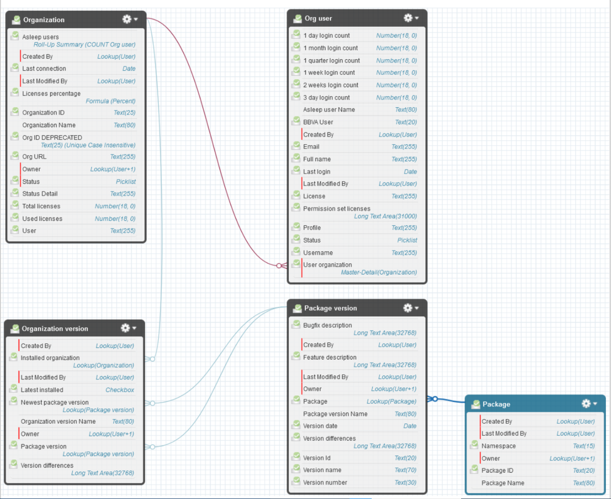
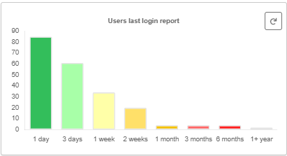
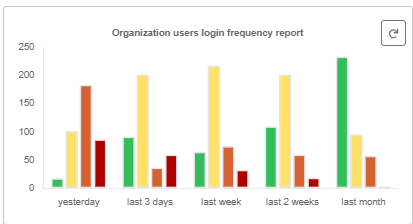
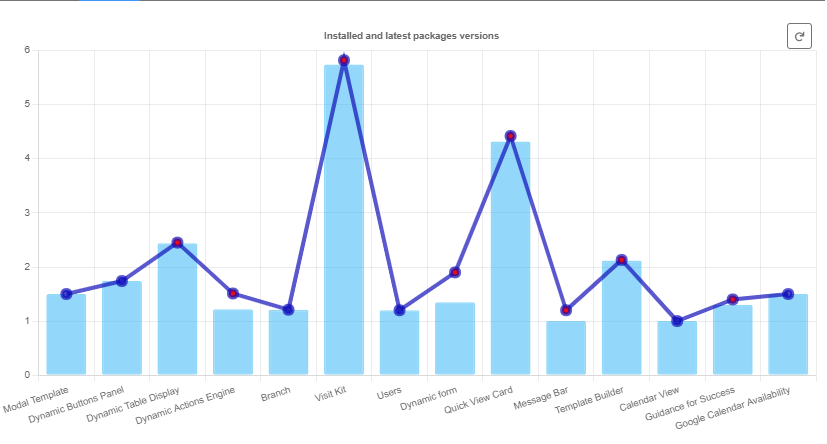
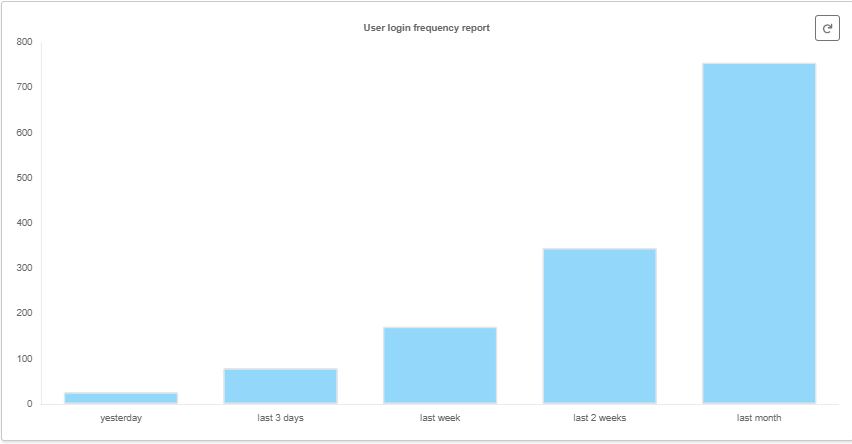

# Sonda KPI Extractor/Receiver

## Description

The objective of this component is to extract information related to the managed packages (global components) that the group takes care of, as well as information related to license usage and user login.

### Why This Component

With this information, which includes data such as the installation version, date, and organization data, the objective is to generate quarterly reports (KPIs) that are presented internally to keep track of the ongoing changes. It also visualizes the frequency of logins, users who have not logged in for a while, and the licenses used in a dashboard.

### Mobility Considerations

The component has been tested in the following scenarios:

Device | Browser/OS | results | Comments
---|:---|---|---
Desktop | Chrome | <span style="color:green">passed</span>
Desktop | Safari | <span style="color:green">passed</span>
Desktop | Firefox | <span style="color:green">passed</span>

## Installation

[Receiver package 3.5](https://login.salesforce.com/packaging/installPackage.apexp?p0=04tJ6000000gTuuIAE)

[Extractor package 1.2](https://login.salesforce.com/packaging/installPackage.apexp?p0=04tJ6000000gNoUIAU)

### Prerequisites

To install Extractor package there are no particular prerequisites

To install Receiver package package [Chart Generator](https://login.salesforce.com/packaging/installPackage.apexp?p0=04t5G000003zgYI) must be installed first, for it is used to paint the different charts.

## Configuration

[This document](https://docs.google.com/document/d/1Jp0FudScxcJ2K1iPueQTT4JZyVSfURt9CeknzmwwGFQ/edit?usp=sharing) explains how to configure the extraction procedure (on both packages)

### Custom Metadata

- [Connection_details__mdt](#Connection_details__mdt)
- [Connection_config__mdt](#CustomMetadata2__mdt)

#### <a name="Connection_details__mdt"></a> Connection details

This metadata is used to provide some information about the org

Field Name | Type | Default Value | Sample Value | Description
---|:---|---|---|---
`User`|String|-|globals.integrator@bbva.com|stores the value to display
`Url`|String|-|https://bbvacs.my.salesforce.com|stores the value to display

#### <a name="Connection_config__mdt"></a> Connection config

This metadata is used for the connection to take place.
Main record is hidden, and no more are to be added

### Custom Objects (Receiver package only)

- [Organization](#Organization)
- [Org user](#Org_user)
- [Package](#Package)
- [Package version](#Package_version)
- [Organization version](#Organization_version)



### Components

- [kpi_charts](#kpi_charts): **Deprecated**
- [kpi_chart_wrapper](#kpi_chart_wrapper): Component to paint user profiles and geography charts
- [kpi_charts_lastLogin](#kpi_charts_lastLogin): Component to paint last
 login graphic with chartjs



- [kpi_charts_orgLogins](#kpi_charts_orgLogins): Component to paint user's login frequency graphic with chartjs



- [kpi_charts_packages](#kpi_charts_packages): Component to paint package version comparison graphic with chartjs



- [kpi_charts_userLogin](#kpi_charts_userLogin): Component to paint a particular user's login frequency graphic with chartjs



### Permission set (Receiver package only)

- KPI_administrator: gives access to Receiver package objects
- Consultation Cib: permission set for access this org's data, dashboards and reports
- Consultation Peru Enterprise: permission set for access this org's data, dashboards and reports
- Consultation Peru Retail: permission set for access this org's data, dashboards and reports
- Consultation Colombia Enterprise: permission set for access this org's data, dashboards and reports
- Consultation Colombia Retail: permission set for access this org's data, dashboards and reports
- Consultation Argentina: permission set for access this org's data, dashboards and reports
- Consultation Client Solutions: permission set for access this org's data, dashboards and reports
- Consultation Maxmistral: permission set for access this org's data, dashboards and reports
- Consultation España Retail: permission set for access this org's data, dashboards and reports
- Consultation Mexico Enterprise: permission set for access this org's data, dashboards and reports
- Consultation Mexico Retail: permission set for access this org's data, dashboards and reports
- Consultation Mexico Seguros: permission set for access this
org's data, dashboards and reports

## Technical Documentation

[Technical document on drive](https://docs.google.com/document/d/1U2klqD91g0nIOXqmRyztWHDMIqGSTiXYF8rILh7e12Y/edit?usp=sharing)

## Scratch Installation

### Instructions

Install Salesforce DX. Enable the Dev Hub in your org or sign up for a Dev Hub trial org and install the Salesforce DX CLI. Follow the instructions in the [Salesforce DX Setup Guide](https://developer.salesforce.com/docs/atlas.en-us.sfdx_setup.meta/sfdx_setup/sfdx_setup_intro.htm?search_text=trial%20hub%20org) or in the [App Development with Salesforce DX](https://trailhead.salesforce.com/modules/sfdx_app_dev) Trailhead module.

1. Clone this repository:

```sh
git clone ssh://git@globaldevtools.bbva.com:7999/chnlsfdc/enterprise_extractor.git
cd enterprise_extractor
```

1. Create a scratch org and provide it with an alias:

```sh
sfdx force:org:create -s -f config/project-scratch-def.json -a enterprise_extractor
```

1. Check the new scratch org with 'enterprise_extractor' alias:

```sh
sfdx force:org:list
```

1. Push the app to your scratch org:

```sh
sfdx force:source:push
```

1. Install development environment connected app

```sh
sfdx force:package:install --package 04t07000000t4DaAAI --wait 10 --noprompt
```

1. Open the scratch

```sh
sfdx force:org:open
```

### Development Environment

The org for development is [https://eext-dev-ed.develop.my.salesforce.com](https://eext-dev-ed.develop.my.salesforce.com).
Please contact globalhub_components.group@bbva.com if you want to request a user & password for this org.

### Important for developers

Before packaging, you must add connection config values for the custom metadata (client id and client secret), which can be found on development org.

Also, you have to add connected app dependency (copy from demo folder)

This changes have to be reverted before commit, so secret is not visible and so org deploy doesnt throw errors
